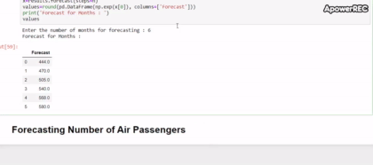
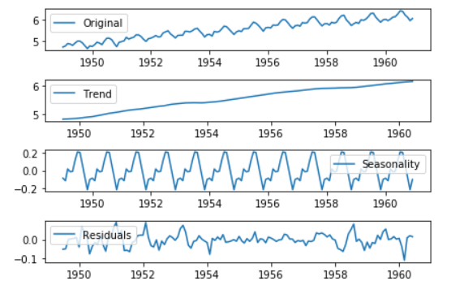
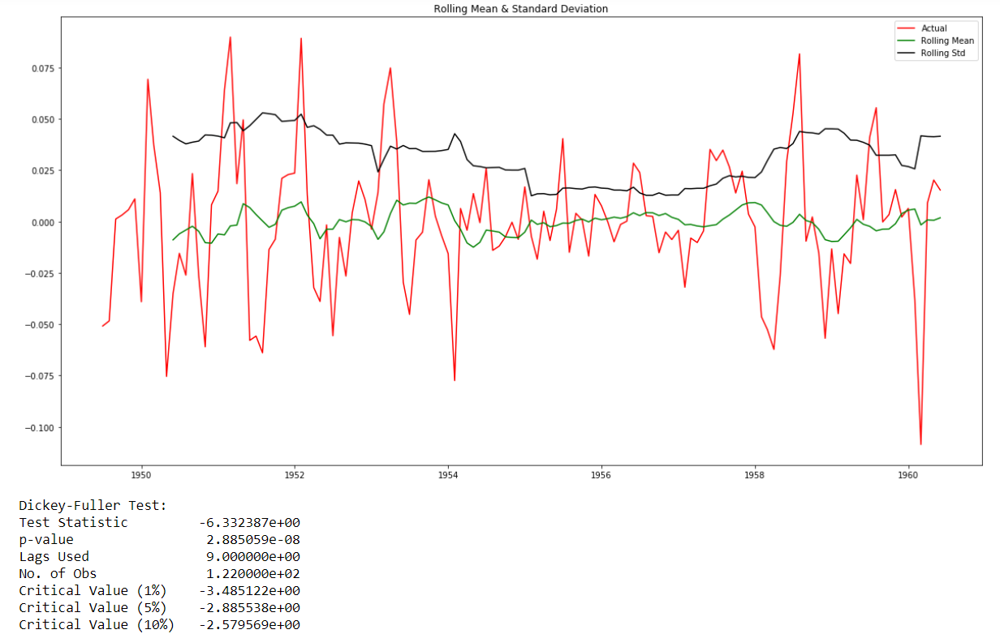
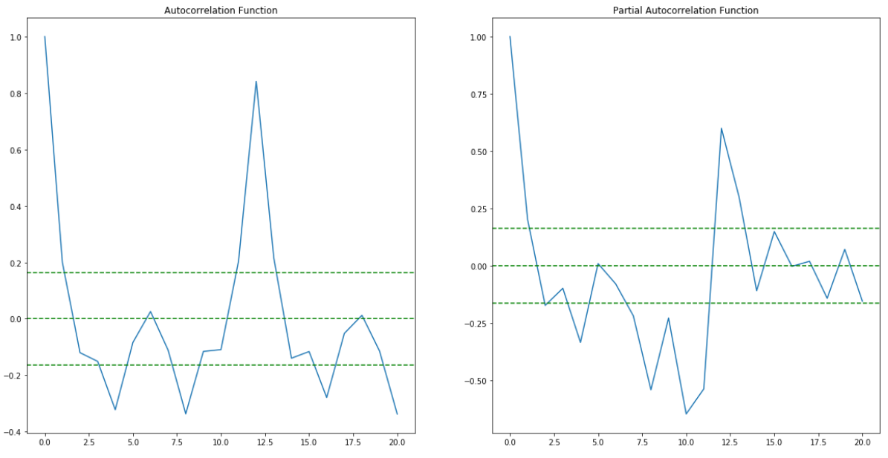
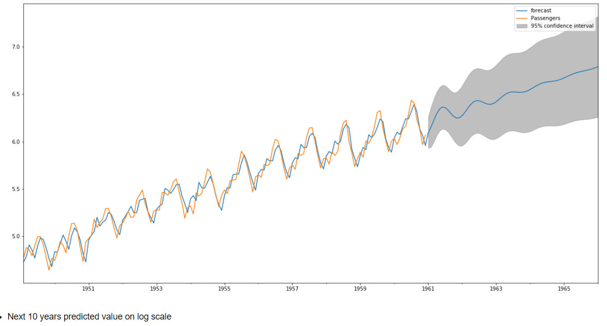

# Air Passengers Time Series Forecasting using ARIMA
Forecasting number of passengers for airlines using ARIMA model in python.
You can view the project demo on [YouTube](https://www.youtube.com/watch?v=zkw2CZEssT8).
   
## Table of contents

* [Installation](#installation)
* [General info](#general-info)
* [Screenshots](#screenshots)
* [Demo](#demo)
* [Methods and Tools](#methods-and-tools)
* [Code Examples](#code-examples)
* [Status](#status)
* [Contact](#contact)

## Installation
```bash
git clone https://github.com/Manishms18/Air-Passengers-Time-Series-Forecasting-using-ARIMA.git
cd Air-Passengers-Time-Series-Forecasting-using-ARIMA
pip install -r requirements.txt
```

## General info

Project was Time Series Analysis, used ARIMA method to build the model.
Major steps involved were as follow :                                 
* STEP: 1 - Data Cleaning and Analysis
* STEP: 2 - Checking Stationarity (ADF Test) 
* STEP: 3 - Transformation  
* STEP: 4 - Differencing
* STEP: 5 - Time Series Components 
* STEP: 6 - Finding ACF and PACF
* STEP: 7 - ARIMA Modeling 
* STEP: 8 - Forecast

## Demo



**The entire demo of the project can be found on [YouTube](https://www.youtube.com/watch?v=zkw2CZEssT8).**

## Screenshots






## Methods and Tools
* Python 
* Advanced Excel
* ARIMA 
* Augmented Dickey-Fuller Test
* ACF and PACF
* Statsmodels

## Code Examples

````
# Code for Augemneted Dickey-Fuller Test and Rolling Mean to check stationarity  

def stationarity(timeseries):
    
    rolmean=timeseries.rolling(window=12).mean()
    rolstd=timeseries.rolling(window=12).std()
    
    plt.figure(figsize=(20,10))
    actual=plt.plot(timeseries, color='red', label='Actual')
    mean_6=plt.plot(rolmean, color='green', label='Rolling Mean') 
    std_6=plt.plot(rolstd, color='black', label='Rolling Std')
    plt.legend(loc='best')
    plt.title('Rolling Mean & Standard Deviation')
    plt.show(block=False)
    
    print('Dickey-Fuller Test: ')
    dftest=adfuller(timeseries['Passengers'], autolag='AIC')
    dfoutput=pd.Series(dftest[0:4], index=['Test Statistic','p-value','Lags Used','No. of Obs'])
    for key,value in dftest[4].items():
        dfoutput['Critical Value (%s)'%key] = value
    print(dfoutput)

````

## Status
Project is: _finished_.

## Contact
If you loved what you read here and feel like we can collaborate to produce some exciting stuff, or if you
just want to shoot a question, please feel free to connect with me on 
<a href="mailto:manishshukla.ms18@gmail.com">email</a> or 
<a href="https://www.linkedin.com/in/manishshukla-ms/" target="_blank">LinkedIn</a>


## Citation
````
@misc{zenodo16906037,
  author       = {Manish Shukla},
  title        = {Air Passengers Time Series Forecasting using ARIMA},
  year         = {2019},
  publisher    = {Zenodo},
  doi          = {10.5281/zenodo.16906037},
  url          = {https://doi.org/10.5281/zenodo.16906037}
}

@misc{shukla_air_passengers_arima_rs7419928_v1,
  title        = {Air Passengers Time Series Forecasting using ARIMA},
  author       = {Shukla, Manish},
  howpublished = {Research Square preprint, Version 1},
  doi          = {10.21203/rs.3.rs-7419928/v1},
  url          = {https://www.researchsquare.com/article/rs-7419928/v1},
  note         = {CC BY 4.0. Accessed: 2025-08-22}
}
````

