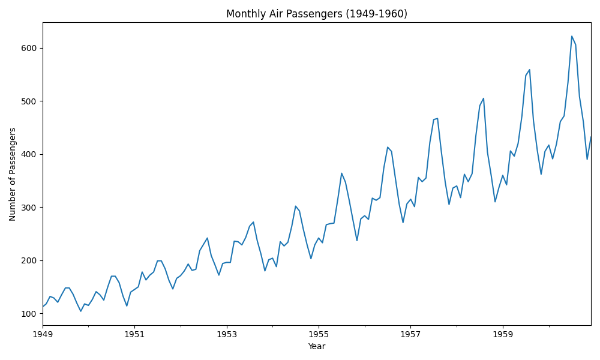
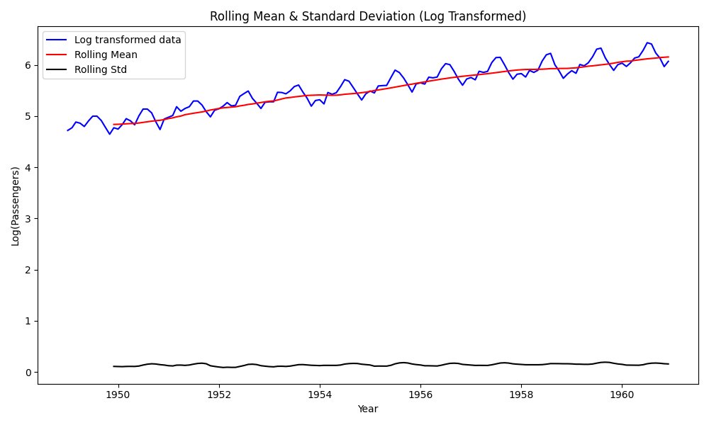
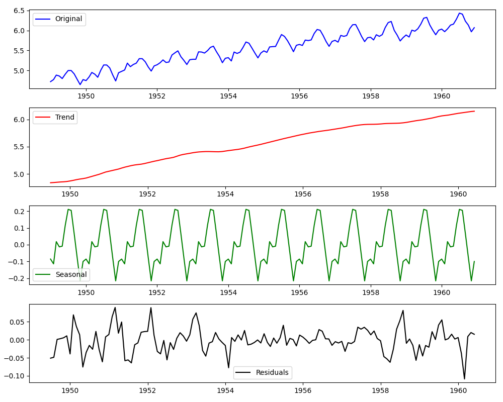
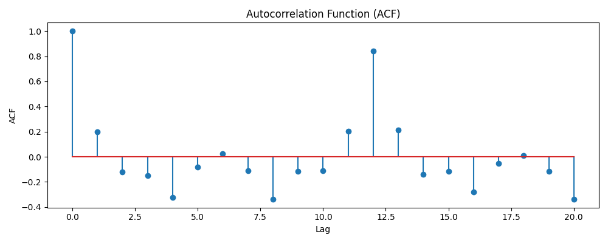
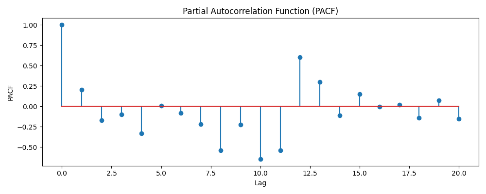
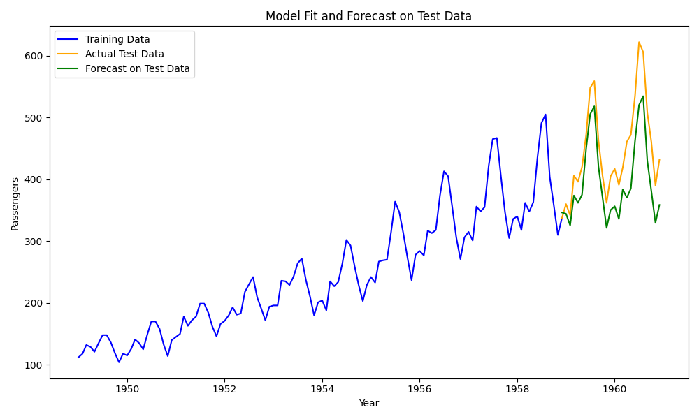
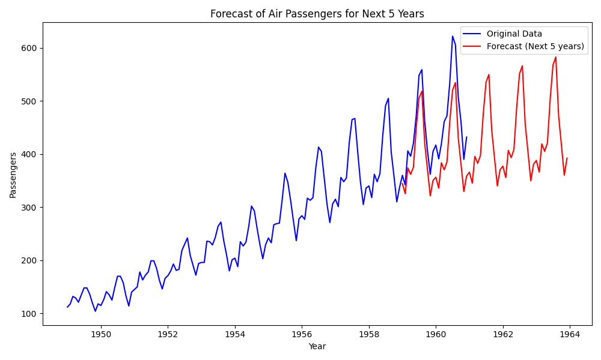

# Summary

This paper presents an open-source implementation of time series forecasting on the classical Air Passengers dataset. The repository demonstrates exploratory data analysis, seasonal decomposition, stationarity checks, ARIMA model building, and performance evaluation. The goal is to provide a reproducible and well-documented workflow for researchers and practitioners learning time series modeling.

# Statement of need

Time series forecasting is central in many domains such as finance, transport, and energy. While textbooks describe methods, accessible open-source implementations with detailed steps remain limited. This repository fills that gap by offering reproducible Jupyter notebooks, enabling students and researchers to quickly apply standard statistical models and interpret results.

# Software description

- **Repository**: [GitHub - Air Passengers Time Series Forecasting using ARIMA](https://github.com/Manishms18/Air-Passengers-Time-Series-Forecasting-using-ARIMA)
- **Language**: Python (with pandas, statsmodels, matplotlib, seaborn)
- **Features**:
  - Data preprocessing and visualization
  - Trend, seasonality, residual decomposition
  - Augmented Dickey-Fuller test for stationarity
  - ARIMA model fitting and diagnostics
  - Forecast visualization and error metrics

## Figures














# Example usage

```python
from statsmodels.tsa.arima.model import ARIMA
import pandas as pd

# Load dataset
df = pd.read_csv("AirPassengers.csv")
series = df["#Passengers"]

# Fit ARIMA model
model = ARIMA(series, order=(2,1,2))
model_fit = model.fit()

# Forecast
forecast = model_fit.forecast(steps=12)
print(forecast)
```

# References

References are listed in `paper.bib` and cited as follows:  
- Classical ARIMA methods [@boxjenkins1976; @chatfield2003]  
- Forecasting practice [@hyndman2008]  
- This repository [@zenodo16906037]  
- Related interpretability work [@shukla2025lime]  
